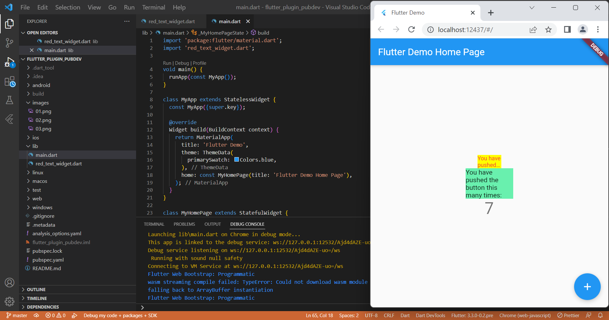

# flutter_plugin_pubdev

Praktikum Plugin Flutter

## Soal Nomor 1
### Selesaikan Praktikum tersebut, lalu dokumentasikan dan push ke repository Anda berupa screenshot hasil pekerjaan beserta penjelasannya di file README.md!

Pada praktikum ini, kita diajarkan untuk menambahkan sebuah plugin pada project flutter yang telah dibuat

## Soal Nomor 2
### Jelaskan maksud dari langkah 2 pada praktikum tersebut!
Maksud dari langkah 2 praktikum diatas merupakan langkah untuk memasukkan plugin dengan nama "auto_size_text" ke dalam project flutter yang telah di buat. Pada langkah ini kita menjalankan perintah "flutter pub add" agar plugin dapat masuk ke project flutter kita

## Soal Nomor 3
### Jelaskan maksud dari langkah 5 pada praktikum tersebut!
Pada langkah ke-5 ini, kita menambahkan variable dengan nama "text" untuk dapat menjalankan method "AutoSizeText". Dan juga, pada praktikum ini kita menambahkan konstruktor dari class "red_text_widget". Sehingga apabila class akan digunakan, kita sebagai user harus menambahkan konstruktor saat memanggilnya.

## Soal Nomor 4
### Pada langkah 6 terdapat dua widget yang ditambahkan, jelaskan fungsi dan perbedaannya!
Pada widget pertama, disini container menggunakan method RedTextWidget, method ini menggunakan plugin auto_size_text yang telah kita tambahkan ke dalam project ini. Dengan menggunakan plugin tersebut, text yang di tampilkan akan lebih teratur. Berbeda dengan widget yang kedua, text yang di tampilkan kurang teratur.

## Soal Nomor 5
### Jelaskan maksud dari tiap parameter yang ada di dalam plugin auto_size_text berdasarkan tautan pada dokumentasi ini !
- Text : digunakan untuk menampilkan data berupa text ke device.
- Style : digunakan untuk mengatur style widget yang akan ditampilkan.
- maxLines : digunakan untuk memberikan maksimal baris yang bisa ditampilkan.
- overflow : digunakan untuk mengatur tampilan text yang menggunakan tipe overflow.